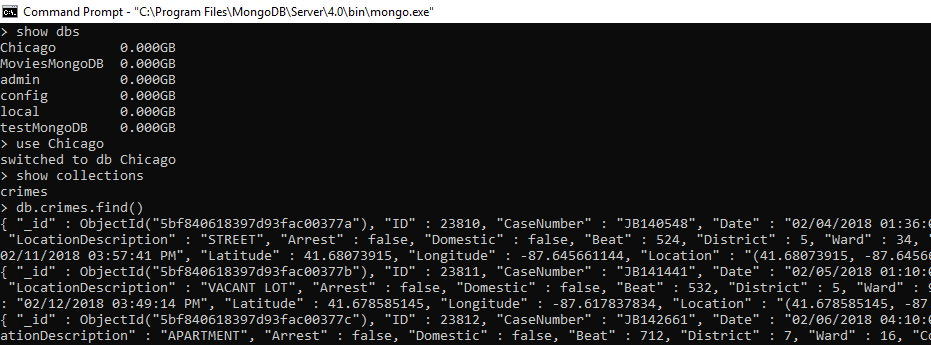
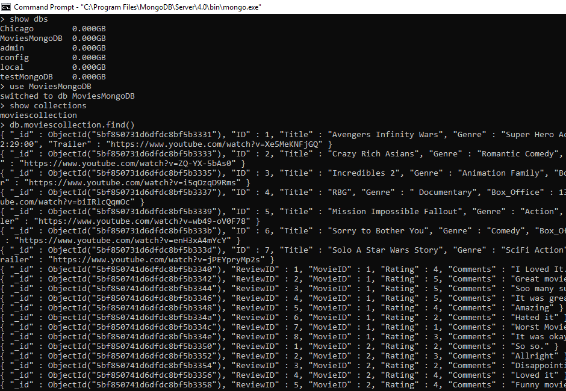

```{r setup, include=FALSE}
knitr::opts_chunk$set(echo = TRUE)
```


```{r, include=FALSE}
library(ggplot2)
library(dplyr)
library(maps)
library(ggmap)
library(mongolite)
library(lubridate)
library(gridExtra)

```


```{r, include=FALSE}
library(devtools)
install_github(repo = "mongosoup/rmongodb")
```


##DATA 607 Fall 2018 - Week 12 Assignment

###Objective
Take information from a relational database created in week two's assignment and migrate it to a MongoDB NoSQL database using R.

###Plan
1. Practice with the MongoDB tutorial.
2. Incorporate the Movies SQlite database from Week 2. 
3. Migrate the data from the Movies database into MonogoDB
4. Final reflections


###1. Practice with the MongoDB Tutorial

For this step, I installed the MongoDB database (community edition). 

[Mongo Tutorial](https://docs.mongodb.com/manual/installation/)


```{r}
library(rmongodb)
# connect to MongoDB
mongo = mongo.create(host = "localhost")
print(mongo.is.connected(mongo))
```

```{r}
#Read in the Chicago crimes dataset
crimes=data.table::fread("Chicago Homicides 2018.csv")
names(crimes)

```

```{r}
#Clean the data
names(crimes) = gsub(" ","",names(crimes)) 
names(crimes)
```

```{r}
#Create a database and collection called crimes
my_collection = mongo(collection = "crimes", db = "Chicago") # create connection, database and collection
my_collection$insert(crimes)
```

```{r}
#Take a look at the information
my_collection$info()
```


```{r}
#Take a count of the collection
my_collection$count()
```

```{r}
#Iterate over one table in the database
my_collection$iterate()$one()
```

The results from the tutorial are also confirmed on the MongoDB server shown in the screen shots below:



With the success of the tutorial, close the connection.

```{r}
#Close the connection to the mongoDB
mongo.destroy(mongo)
print(mongo.is.connected(mongo))
```

###2. Incorporate the Movies SQlite database from Week 2. 

In this section, I read in the SQLite Movies database created from the Week 2 Assignment.


```{r, include=FALSE}
options(warn=-1)
library(DBI)
library(RMySQL)
library(stringr)
library(ggplot2)
library(dplyr)
```

```{r}
#create a connection to the SQLite database
conn<- dbConnect(RMySQL::MySQL(),
                  dbname="movie_reviews",
                  host="DESKTOP-FGDMVA4",
                  user="Student01", 
                  password="CUNY_DATA607"
                  )
```
####Printout list of tables in the connection

```{r}
dbListTables(conn)
```
```{r include=FALSE}
#Convert the tables to dataframes
Reviewers <- dbReadTable(conn, 'Reviewers')
Reviews <- dbReadTable(conn, 'Reviews')
Movies <- dbReadTable(conn, 'movies')

Reviewers$Gender<- str_replace_all(Reviewers$Gender, "\r", "")
Movies$Trailer <- str_replace_all(Movies$Trailer, "\r", "")
Reviews$Comments <- str_replace_all(Reviews$Comments, "\r", "")

```

###3. Migrate the data from the Movies database into MonogoDB

MW Frost code for migrating a R dataframe to MongoDB.  

[R function migrates code to MongoDB](https://gist.github.com/mwfrost/6385201)


```{r}
#The parameters take in a dataframe, the name of the Mongo DB, the name of the collection and the variable names of a dataframe
convert_Movies_df <- function(df, db='MoviesMongoDB', col='moviescollection', fields=names(df)) {
#Create a connection 
    mongo <- mongo.create(host = "localhost")
  if (mongo.is.connected(mongo)) {
#Iterates over each row of the dataframe and converts it to bson object which is then inserted into the Mongo instance.
    for(i in 1:nrow(df)) {
        b <- mongo.bson.from.list(df[i,fields])
        if (!is.null(b)){
          mongo.insert(mongo, paste(db, col, sep='.'), b)
          #print("loaded")
          }
        else {
          print('NULL BSON object')
          print(t(df[i,]))
              }
      }  
  }
}
```

Apply the function to each dataframe

```{r}
convert_Movies_df(Movies)
convert_Movies_df(Reviews)
convert_Movies_df(Reviewers)
```


```{r}
movies_collection = mongo(collection = 'moviescollection', db='MoviesMongoDB')
movies_collection$info()

```

A check on the number of rows in the dataframes from the SQlite database and the Mongodb collection confirms that the counts are accurate

```{r}

movies_collection$count()
nrow(Reviews) + nrow(Reviewers) + nrow(Movies)
```


```{r}
movies_collection$iterate()$one()
```

A screen shot from the Mongo instance also shows that the data has been migrated:





###4. Final reflections
I found this to be one of the more challenging assignments of the semester.  I am very intrigued about Graph databases and NoSQL databases as this will become the standard database in my field of E-Discovery.  As data grows larger and sources become more diverse, traditional relational databases may not be adquate.  

Finally, I was not able to get the "mongo.get.database.collections" function to work properly, and I cannot figure it out.


```{r}
mongo_new <- mongo.create(host = "localhost", db='MoviesMongoDB')
mongo.is.connected(mongo_new)

```

```{r}
mongo.get.database.collections(mongo_new, db='MoviesMongoDB')
```


