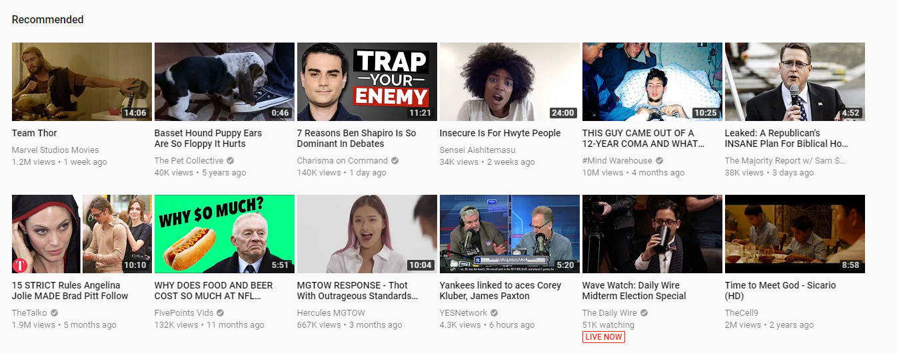

```{r setup, include=FALSE}
knitr::opts_chunk$set(echo = TRUE)
```

## Discussion 11

This is an R Markdown document. Markdown is a simple formatting syntax for authoring HTML, PDF, and MS Word documents. For more details on using R Markdown see <http://rmarkdown.rstudio.com>.
DATA607 Fall 2018
Recommender System - YouTube
John K. Hancock


YouTube is a video sharing service where users can post videos.  Since its inception in 2005, it has now grown to offer commercial streaming services of video content as well as user created content. YouTube hosts videos for almost every interest from academic, to political, to cultural, to cat videos and beyond.
Upon accessing the website, you are shown a panel of recommended videos:


 
1.	The target users/customers of YouTube are marketers looking to target specific consumer markets no matter the size.  Before every video, the free version of YouTube plays a five second advertisement which is related to the video being viewed.  

2.	 YouTube's real users (marketers) need to be able to sell their products/services directly to those consumers who are most likely to buy their products/services.  YouTube offers detailed marketing strategies to marketers. This link provides information on marketing strategies and even includes on call assistance. https://www.youtube.com/intl/en-GB/yt/advertise/resources/optimizing-your-video-marketing-campaigns/

3.	Recommendation: YouTube meet Honey.  Honey is a browser add-on where people click on a button that automatically finds and applies coupon codes at checkout for over 30,000 shopping sites. To assist YouTube marketers, this feature or something along those lines should be incorporated into the YouTube platform.
